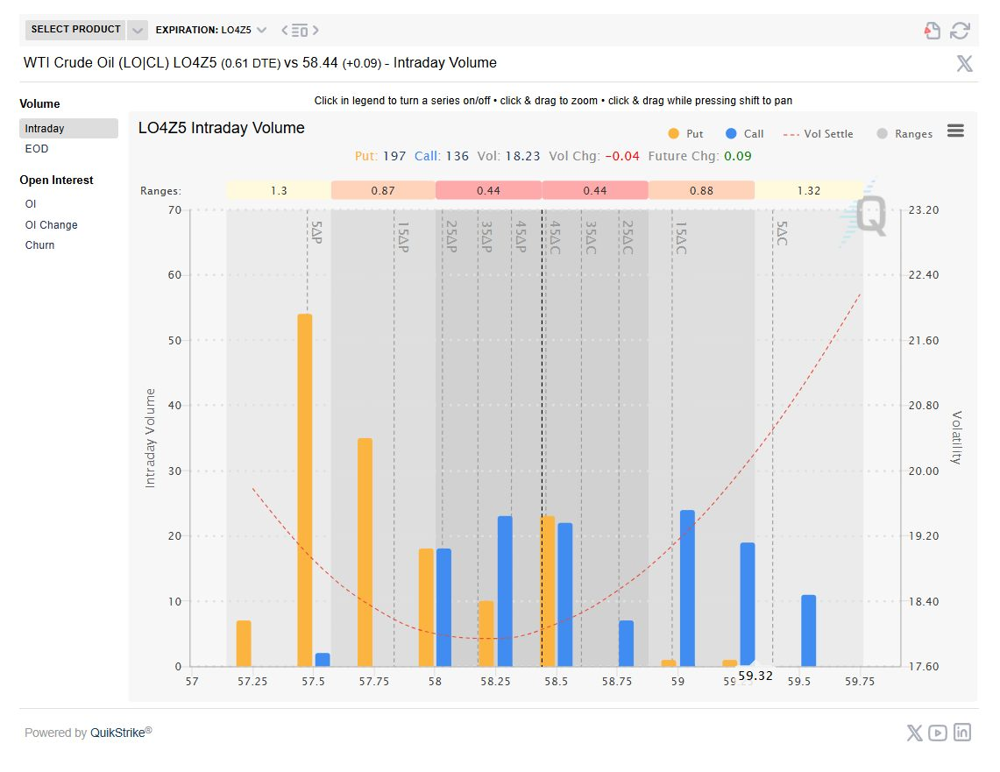

# oi-analyst-vision-model

This project fine-tunes the Qwen3-VL-4B vision-language model to automatically analyze Thai options intraday volume charts. The model can interpret Put/Call distributions, identify support/resistance levels, suggest trading strategies, and assess market volatility - all in Thai language.

## Example Output

**Input**: Intraday Volume Chart
**Output**:
```plaintext
🚨Update วิเคราะห์กราฟ Gold (17:00) OG4Z5 Intraday Volume

1. ภาพรวมการเคลื่อนไหว 📊
ตลาดอยู่ในสภาวะ "Bullish Momentum with High Speculation" โดยมี Future Chg: +41.9
สัดส่วน Put🟠: 1,241 และ Call🔵: 1,261 แสดงว่ามีการซื้อประกันความเสี่ยงควบคู่ไป

2. กลยุทธ์การเทรด 💡
- จุดปะทะสำคัญที่ 4550 (Call Wall สูงสุด)
- หากยืนเหนือ 4550 อาจเกิด Gamma Squeeze ไปหา 4570-4600
- แนวรับที่ 4530 และ 4500

3. Volatility 🔍
- Volatility Smile ต่ำสุดที่ 4510-4520 (stable zone)
- Right Skew สูง แสดงความต้องการ Call Option มาก
...
```

## Dataset
The model was fine-tuned on 97 image-text pairs consisting of:

- **Images**: Thai derivatives intraday volume charts (384×384 resolution)
- **Text**: Detailed Thai analysis covering:
    - Market pattern identification
    - Put/Call wall analysis
    - Trading strategy suggestions
    - Volatility interpretation
    - Key support/resistance levels

### Data Format
**Each training example**:
```json
{
    "image": "path/to/chart.png",
    "instruction": "Analyze this Intraday Volume chart...",
    "output": "🚨Update วิเคราะห์กราฟ..."
}
```
## Model Details
### Base Model
- **Architecture**: Qwen3-VL-4B-Instruct
- **Vision Encoder**: ViT-based image encoder
- **Language Model**: Qwen3-4B decoder

### Fine-tuning Configuration
- **Method**: QLoRA (4-bit quantization + LoRA)
- **LoRA Rank**: 8
- **LoRA Alpha**: 32
- **LoRA_dropout**: 0.05
- **Target Modules**: "q_proj", "k_proj", "v_proj", "o_proj", "gate_proj", "up_proj", "down_proj"
- **Learning Rate**: 2e-4
- **Batch size**: 1(with gradient accumulation=4)
- **Epochs**: 5
- **Training Time**: ~40 minutes on L4 GPU

### Performance Metrics
- **Training Loss**: 1.037900
- **Validation Loss**: 0.824295
- **Memory Usage**: 16 GB of VRAM

## Result
### Sample Analyses

**input image**:



**output**:

```plaintext
📊วิเคราะห์กราฟ WTI Crude Oil (LO4Z5) Intraday Volume: สามารถสรุปรายละเอียดได้ดังนี้

1. ภาพรวมการเคลื่อนไหว (The Pattern)

▪️Volatility Skew (เส้นประสีชมพู): เส้น Vol Settle มีลักษณะเป็นรูปตัว U ในบริเวณราคาใช้สิทธิต่ำกว่า 58.5 และมีค่าสูงขึ้นอย่างชัดเจนครับๆ เมื่อราคาใช้สิทธิสูงขึ้นไปทางขวา สังเกตได้ว่าความผันผวนจะลดลงในฝั่งซ้ายและสูงขึ้นในฝั่งขวา โดยเฉพาะที่ Strike Price 59.25 ที่มีค่า Volatility ใกล้เคียงกับ 20.00 - 22.40

▪️Volume Distribution (แท่งกราฟสีส้มและน้ำเงิน):

🟠Put Volume (สีส้ม): มีปริมาณรวมสูงกว่า Call Volume โดยเฉพาะอย่างยิ่งที่ระดับราคาใช้สิทธิที่ต่ำ เช่น:

Strike 57.5AP: มี Put Volume สูงมากถึงประมาณ 50-60 (แท่งสีส้มโดดเด่นที่สุดในกราฟ)
Strike 58.5AP: มี Put Volume อยู่ที่ประมาณ 20-25

🔵Call Volume (สีน้ำเงิน): มีปริมาณรวมน้อยกว่า Put Volume แต่กระจายตัวออกไปทางขวาของกราฟ

_____________________________

2. กลยุทธ์ที่ตีความได้จาก Volume

▪️Bearish Sentiment (แนวโน้มขาลง): การที่ Put Volume (สีส้ม) กระจุกตัวหนาแน่นในฝั่งราคาต่ำกว่า (OTM Puts) สะท้อนว่านักลงทุนจำนวนมากกำลังซื้อ/ขาย Put เพื่อป้องกันความเสี่ยงหรือเก็งกำไรในทิศทางขาลง (Downside Protection/Speculation)

▪️Resistance Levels (แนวต้านสำคัญ): แท่ง Call Volume สีน้ำเงินที่สูงขึ้นอย่างเห็นได้ชัดบริเวณ Strike 58.5AC, 59.0AC และ 59.25AC บ่งบอกว่านักลงทุนคาดหวังว่าราคามีโอกาสทดสอบหรือหลุดไม่ผ่านระดับเหล่านี้

▪️Straddle/Straight Strategy: การที่มี Volume สูงทั้ง Put และ Call ที่ใกล้เคียงกัน (เช่น Strike 58.5 และ 58.5AC) อาจบ่งชี้ถึงการเข้า Short Straddle หรือ Short Strangle เพื่อรับ Premium จากการคาดการณ์ว่าราคาจะเคลื่อนไหวแรงในทิศทางใดทิศทางหนึ่ง

_____________________________

3. จุดสังเกตเพิ่มเติม (Volatility)

▪️Implied Volatility (IV) โดยรวม: ค่า Volatility โดยรวมของตลาดอยู่ที่ 18.23 โดยมีการเปลี่ยนแปลงเล็กน้อย -0.04

▪️Future Movement: ค่า Future Chg: +0.09 แสดงให้เห็นว่าราคาสินทรัพย์อ้างอิง (Underlying Asset) มีการปรับตัวเพิ่มขึ้นเล็กน้อย (+0.09) ในระหว่างวัน (Intraday)

▪️Range Boundaries: กรอบราคา (Ranges) ระบุไว้ที่ 1.3, 0.87, 0.44, 0.44, 0.88, และ 1.32 ซึ่งบ่งชี้ถึงความผันผวนเฉลี่ยในช่วงเวลาที่ต่างกัน (อาจเป็น Range แบบ Daily High/Low หรือ IV Ranges สำหรับ Option Expiry)
```

## Furthur Improvement
- Expand dataset to 500+ examples
- Optimize inference speed
- Create web app demo
- Fine-tune on larger 7B model for better accuracy

## ⚠️ Disclaimer
This model is for educational and research purposes only. Trading decisions should not be made solely based on AI-generated analysis. Always consult with licensed financial advisors and conduct your own research before making investment decisions.